# SpindleStudio


English · [中文](README.zh-CN.md)

A lightweight, API-first image generation studio. Like Threads, it lets you advance multiple ideas in parallel within a single conversation — no need to wait for one image to finish before sending the next request, referencing an old image, or spawning a variant from any previous result. Built for users who have moved past the "tweak every parameter" phase and just want to iterate on ideas quickly through conversation.

Pairs perfectly with [Infinite Image Browsing](https://github.com/zanllp/sd-webui-infinite-image-browsing): every image SpindleStudio generates carries SD WebUI–compatible EXIF metadata, so your results drop straight into IIB for blazing-fast browsing, searching and tagging.

**Download**: prebuilt Windows installer / portable from [GitHub Releases](https://github.com/zanllp/SpindleStudio/releases).

> **macOS users**: the app is not code-signed, so Gatekeeper reports it as *"damaged and can't be opened"*. After installing, run `xattr -cr /Applications/SpindleStudio.app` once to clear the quarantine flag. Prefer the `.dmg` over the `.zip` (some unzip tools break the app's symlinks).

## What it is

SpindleStudio is not a replacement for Stable Diffusion WebUI / ComfyUI, nor a do-everything AI client. It is deliberately focused:

- 🧵 **Multi-idea parallelism**: multiple in-flight generation requests can progress inside the same session without waiting in line
- 💬 **Conversational iteration**: every message is an independent thread; continue generating from, reference, or backfill any previous result
- 🖼️ **Image-generation-first**: text-to-image and image-to-image, done well
- 🔌 **Multi-provider**: configure multiple backends and switch or call them as needed

If you have used all-in-one clients like Cherry Studio, think of SpindleStudio as the **image-generation-specialized alternative**.

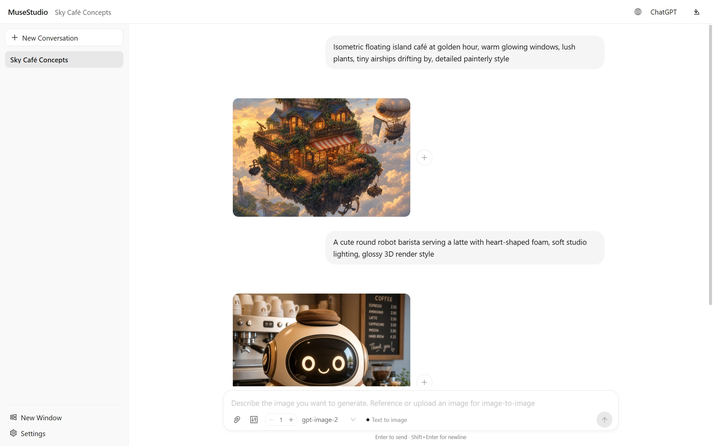

## Features

- **Multi-thread generation in one session**: multiple in-flight requests progress in parallel, Threads-style
- Conversational image generation — every message is a prompt you can iterate on
- Image-to-image via referencing generated images or uploading / pasting local ones
- Batch generation (1–8 images) with progressive per-image rendering
- "Generate one more" on any previous result to append a variant instantly
- In-place prompt edit & resend, backfill to input box, delete, retry
- Generation controls: auto + 13 aspect-ratio presets, 1K / 2K / 4K resolution (4K widescreen-only)
- EXIF metadata baked into every image — prompt, dimensions and model in SD WebUI–compatible format, ready for tools like [Infinite Image Browsing](https://github.com/zanllp/sd-webui-infinite-image-browsing)
- Upload history sorted by usage frequency for one-click reuse of reference images
- Local disk persistence — conversations and in-flight tasks survive refresh / restart
- Multi-window real-time sync — desktop windows and the web UI side by side, everything updates everywhere instantly, per-window themes
- Four themes: ChatGPT / Frutiger Aero / Windows Vista / Windows XP
- English & 中文 UI — follow system or set manually
- In-app settings for API key & base URL

## In action

**Threads-style parallel generation** — fire off several prompts at once; each runs as its own task and lands whenever it's ready:

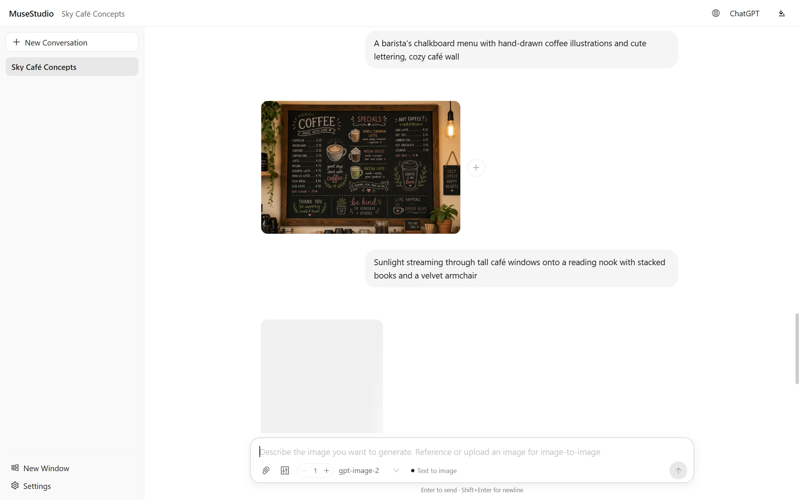

**Image-to-image** — hit the link button on any previous result (or upload / paste your own image) and describe the change:

<table>
  <tr>
    <td>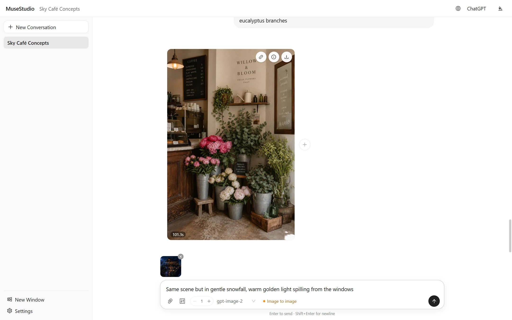</td>
    <td>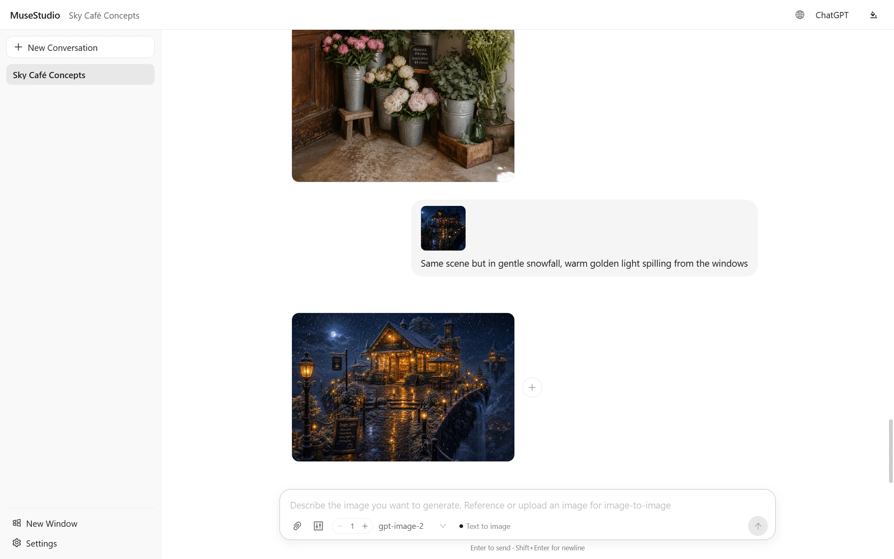</td>
  </tr>
</table>

**Batch up to 8 per message**, each rendering in progressively — and the ⊕ button on any result appends one more variant; hovering a message reveals backfill / edit & resend / delete:

<table>
  <tr>
    <td>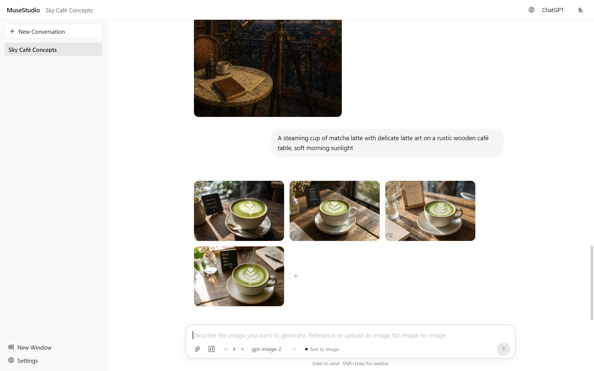</td>
    <td>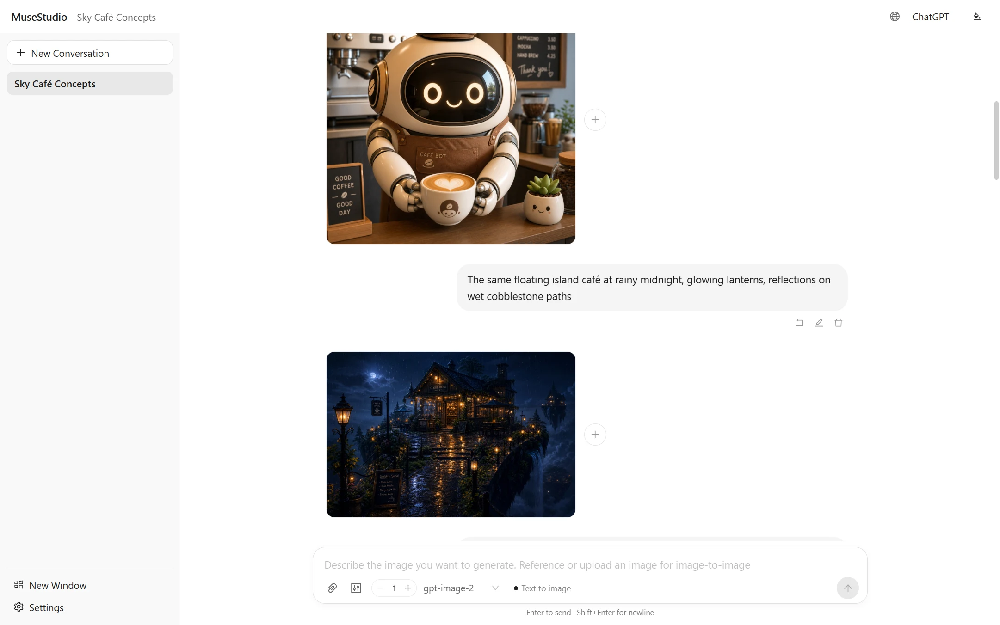</td>
  </tr>
</table>

**Dial in the output** — 13 aspect-ratio presets with 1K / 2K / 4K resolution; **every image remembers how it was made** — prompt, model, dimensions and more, in SD WebUI–compatible EXIF:

<table>
  <tr>
    <td>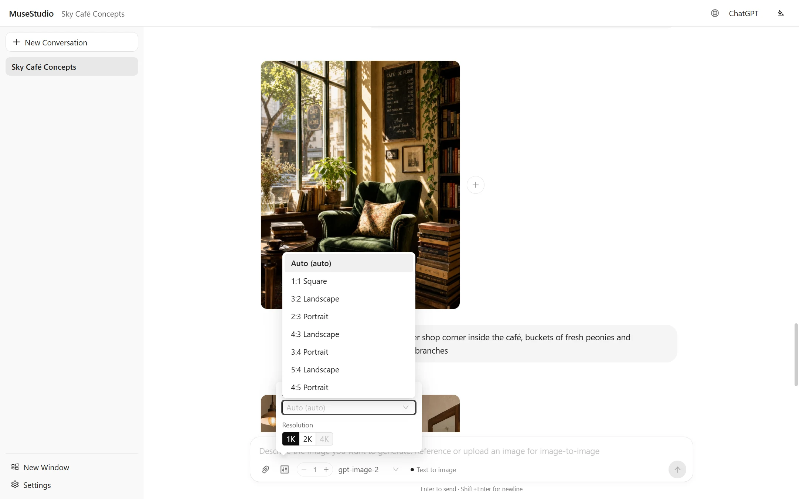</td>
    <td>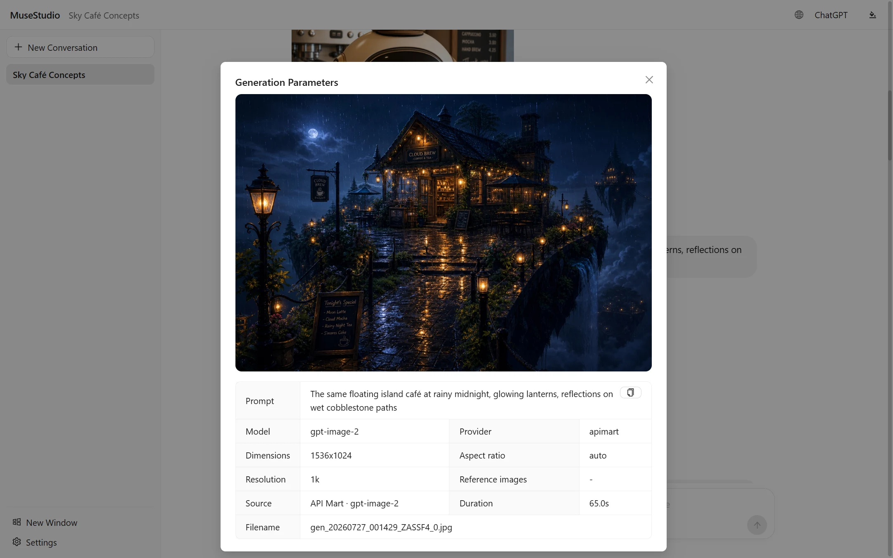</td>
  </tr>
</table>

## Multi-window, always in sync

Open as many windows as you like — extra desktop windows from the sidebar (**New Window**), plus the same app in the browser at `http://localhost:3210` — and every window stays in real-time sync. Send a prompt in one and watch the images land in all the others; new conversations, edits and deletions appear everywhere instantly. Theme is per window, so the browser can run Windows XP while the app stays ChatGPT.

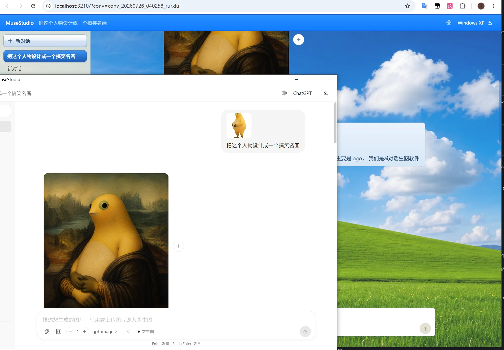

## Themes

Four built-in themes, switchable anytime from the top-right dropdown:

<table>
  <tr>
    <td></td>
    <td>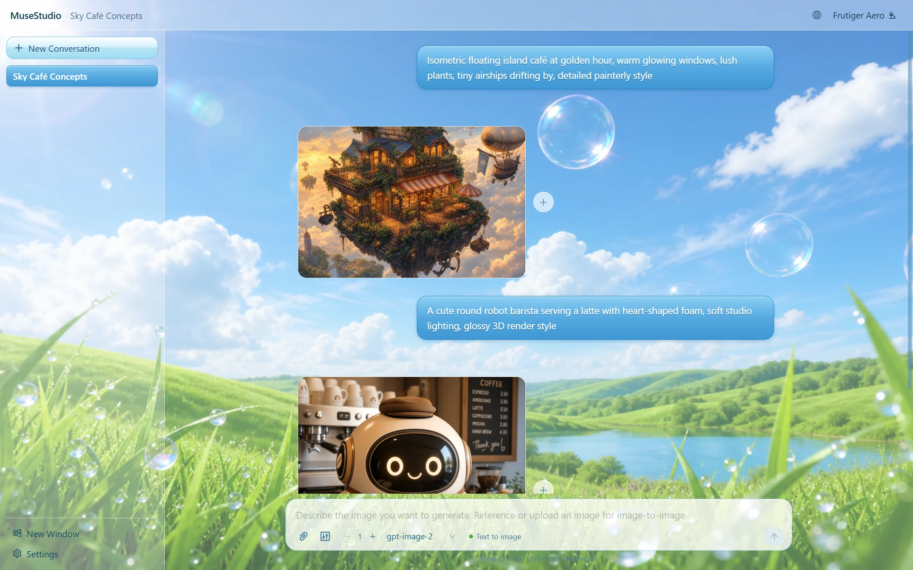</td>
  </tr>
  <tr>
    <td>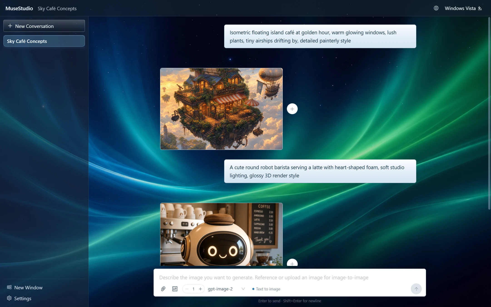</td>
    <td>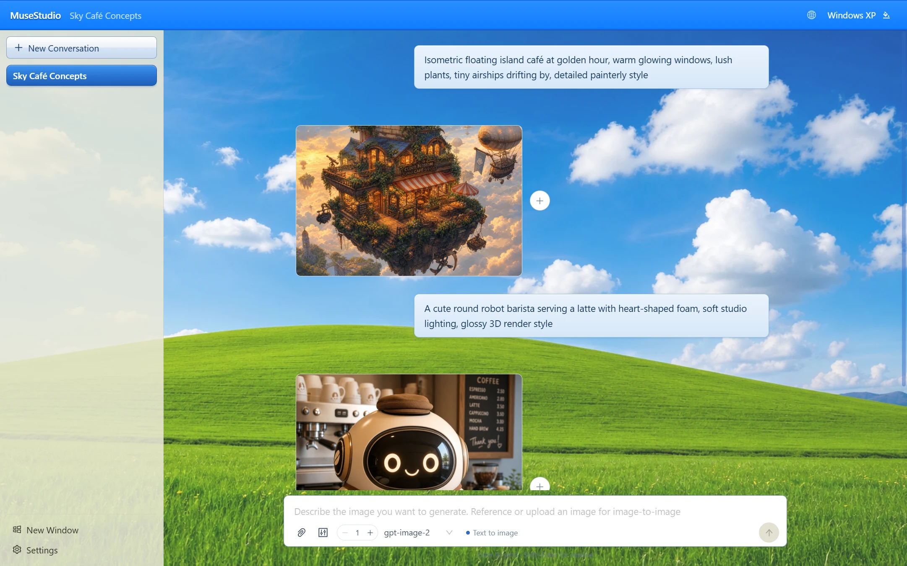</td>
  </tr>
</table>

## Model providers

Multiple backends can live side by side in Settings — each with its own API key, base URL and model list — and the active provider/model is picked per message from the input box. Both sync (OpenAI-compatible images) and async task-style APIs are supported, and custom providers can be added from the UI. Ships with `gpt-image-2` as the default model.

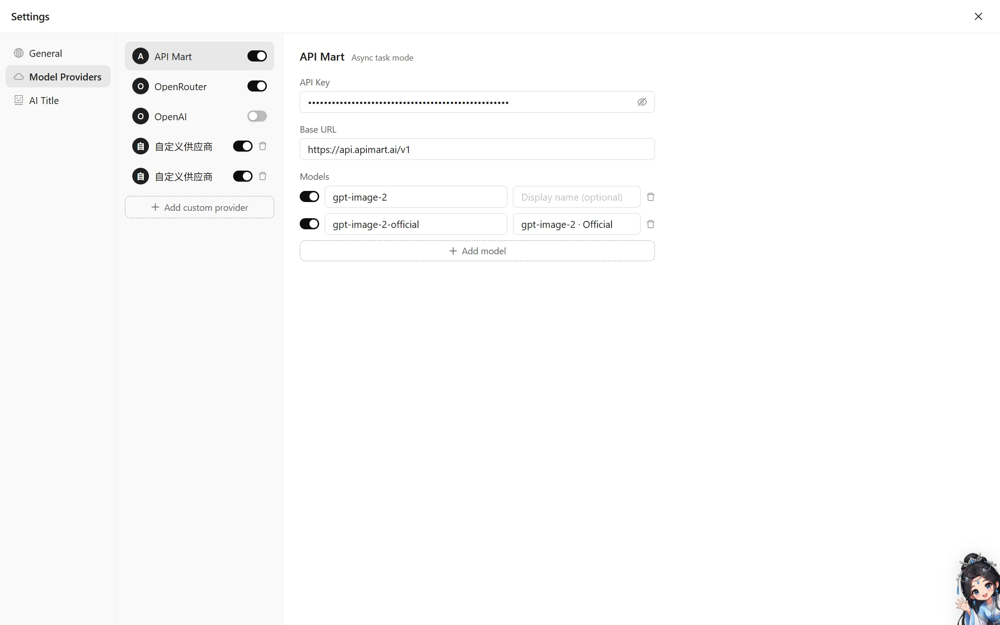

## Getting started

Run from source:

```bash
yarn
yarn dev             # web dev at http://localhost:5173
```

Fill in your API key in the settings dialog on first launch.

### Desktop (Electron)

```bash
yarn dev:electron    # dev mode (Vite + backend + Electron)
yarn build           # build frontend + backend
yarn electron        # run as desktop window (embedded backend)
yarn dist:win        # package Windows installer / portable (electron-builder)
```

### Headless Node (no Electron)

```bash
yarn build
yarn start           # http://localhost:3210
```

## Configuration

Priority: in-app settings (`config.json`) > `.env.local` > `.env` > environment variables. See [.env.example](.env.example).

| Variable | Description |
| --- | --- |
| `APIMART_API_KEY` / `APIMART_BASE_URL` | API Mart seed key / URL (editable in-app) |
| `OPENROUTER_API_KEY` / `OPENROUTER_BASE_URL` | OpenRouter seed key / URL (editable in-app) |
| `OPENAI_API_KEY` / `OPENAI_BASE_URL` | Optional, used only for the "AI title" feature |
| `PORT` | Backend port, default `3210` |
| `HTTPS_PROXY` | Optional outbound proxy |

Data (conversations, generated images, uploads, config) lives in the project directory by default; packaged builds use the OS userData dir.

### Custom data directory (share existing data)

A packaged build can point its data directory at any existing folder (IIB `sd_webui_dir`-style). Precedence: `DATA_DIR` env var > `data-dir.txt` next to the exe > `data-dir.txt` in userData > default. The file contains one absolute path, e.g.:

```
C:\Users\me\repo\SpindleStudio
```

After pointing it at this repo, the packaged build and dev mode share the same conversations / images / config. For headless Node mode (`yarn start`), use the `DATA_DIR` env var. For a one-time import instead of sharing: `yarn migrate <sourceDir> [destDir]`.

## Tech stack

Vue 3 · Vite · TypeScript · Pinia · Ant Design Vue · Express · socket.io (real-time progress) · sharp (EXIF) · Electron

## License

MIT
